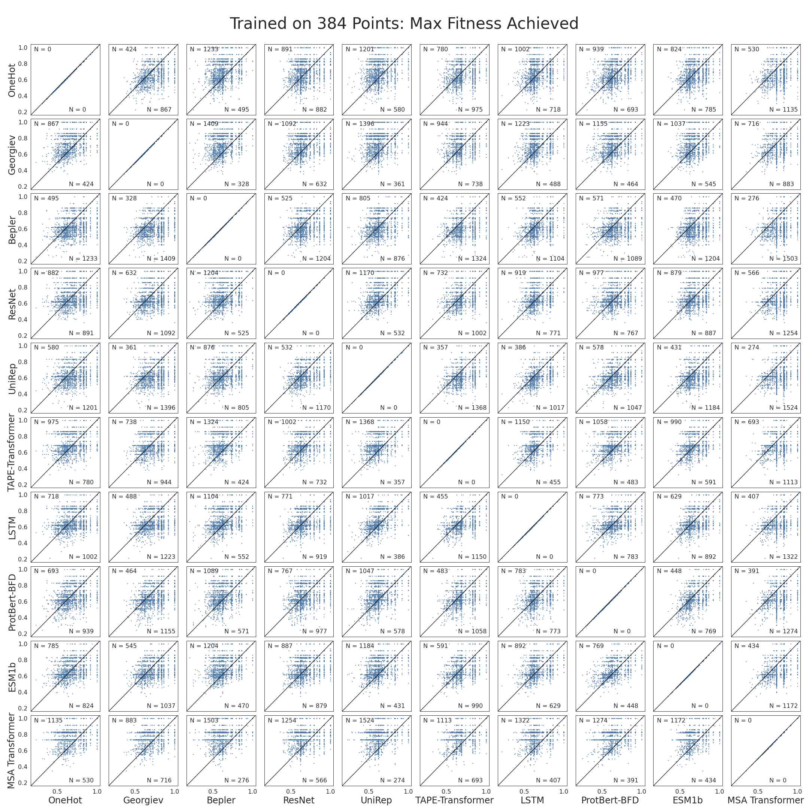
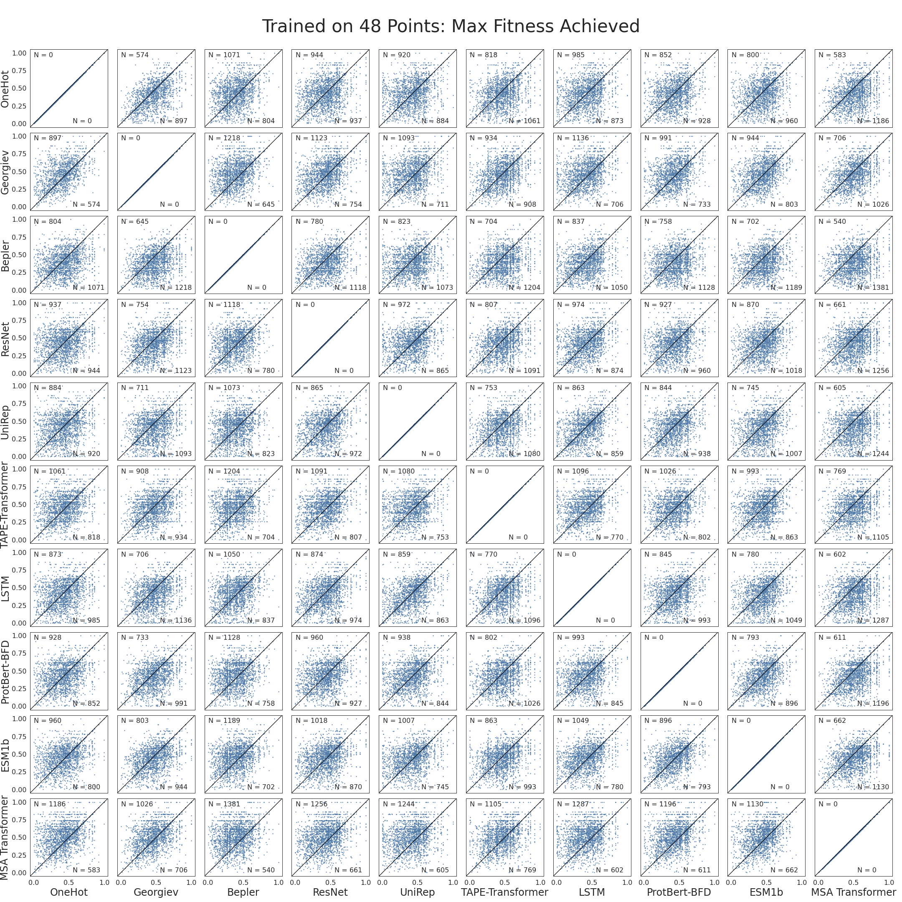
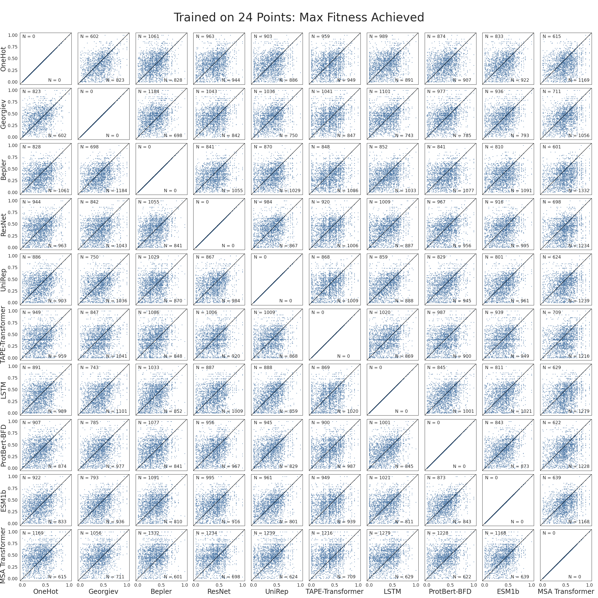
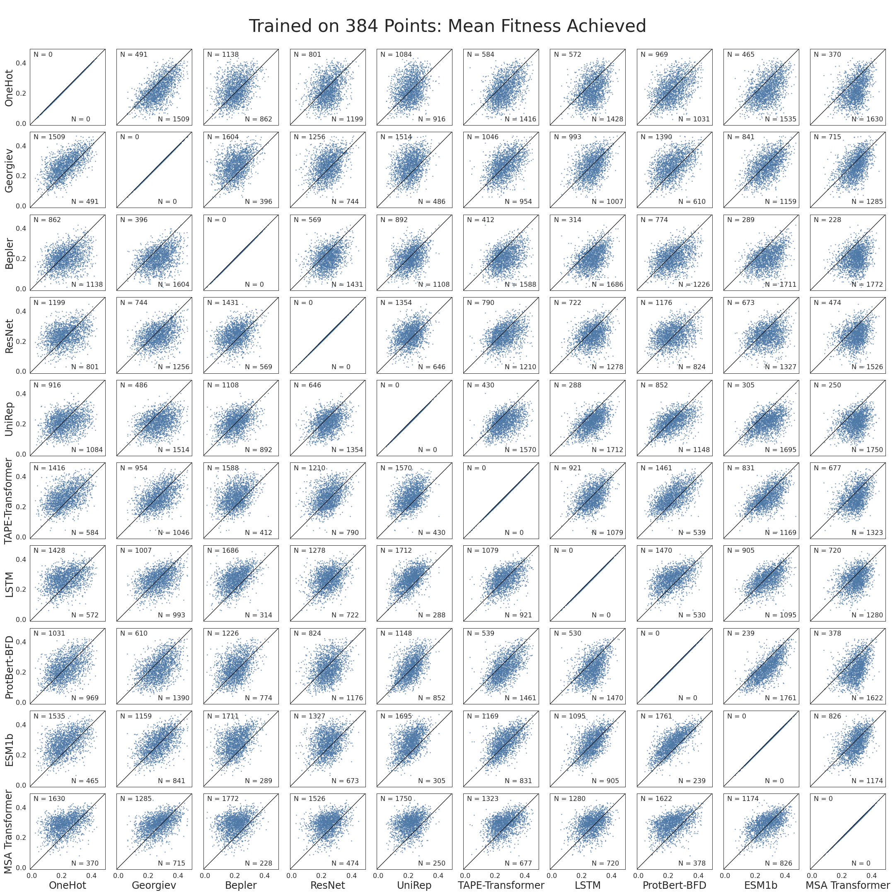
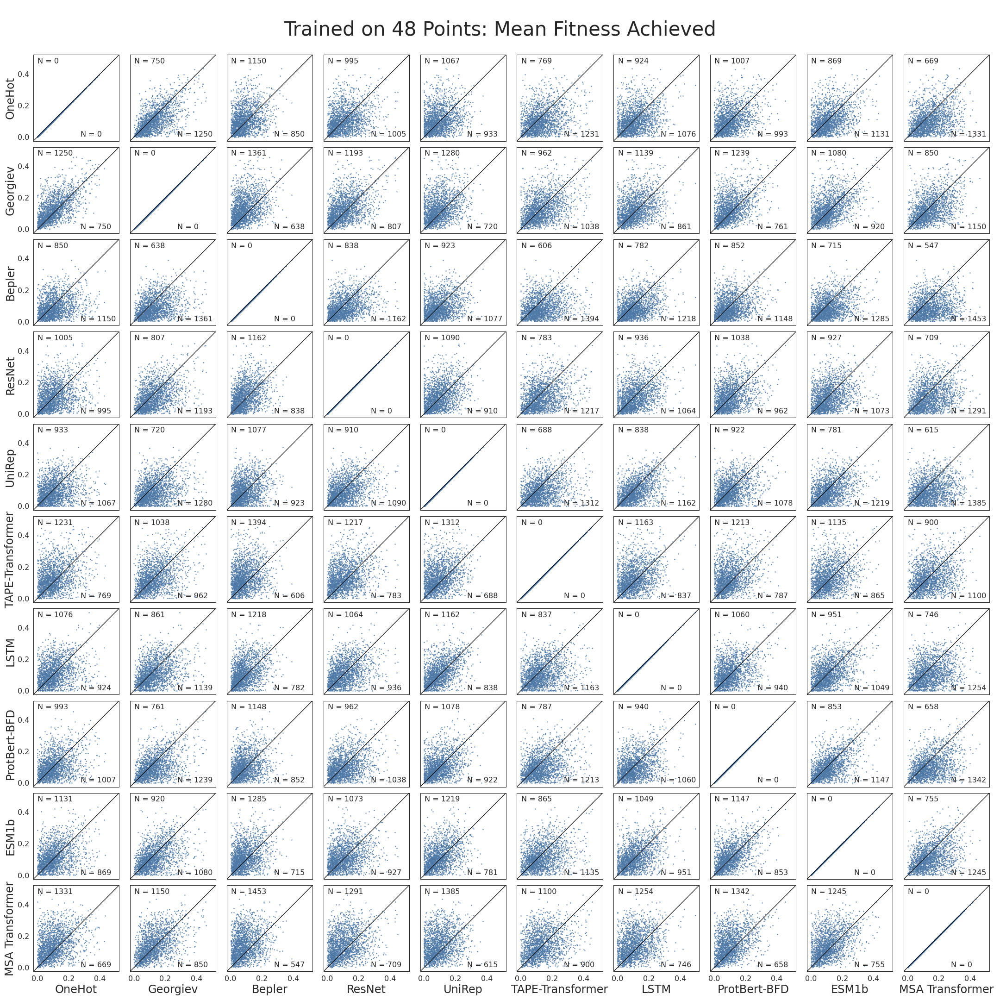
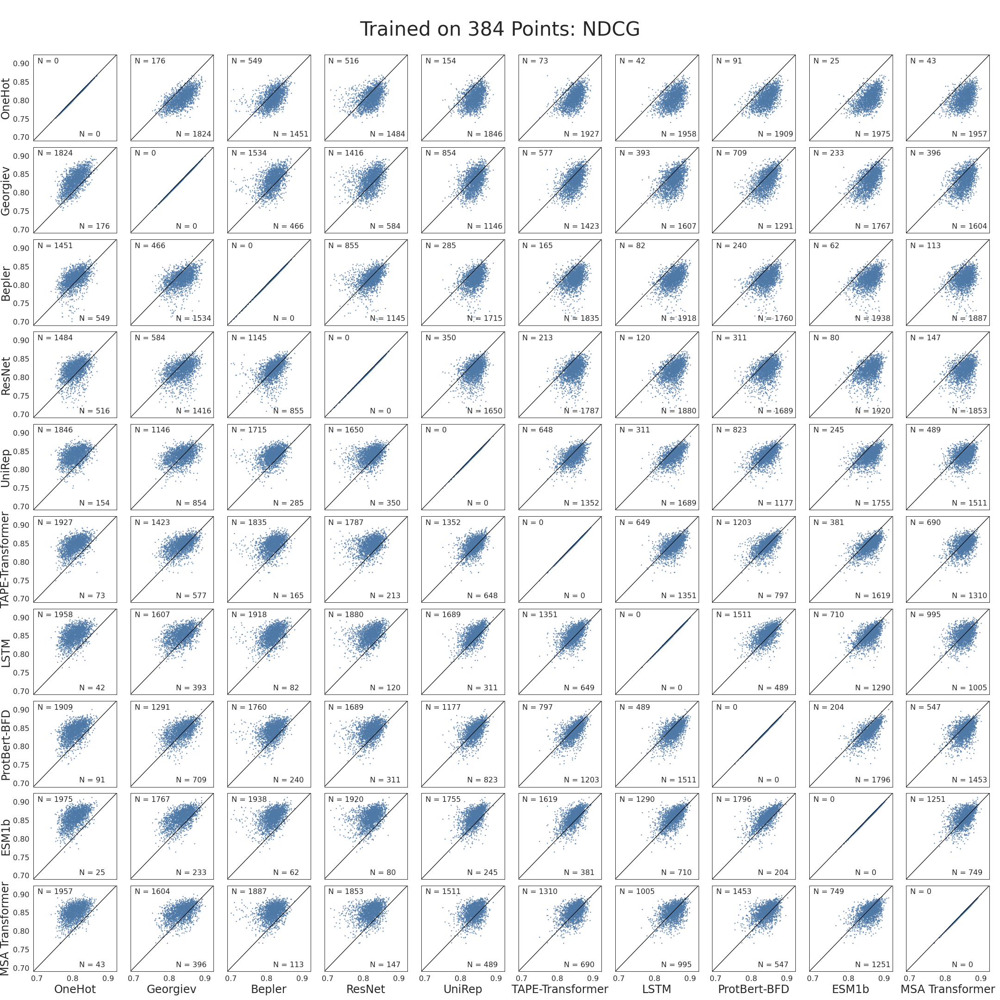
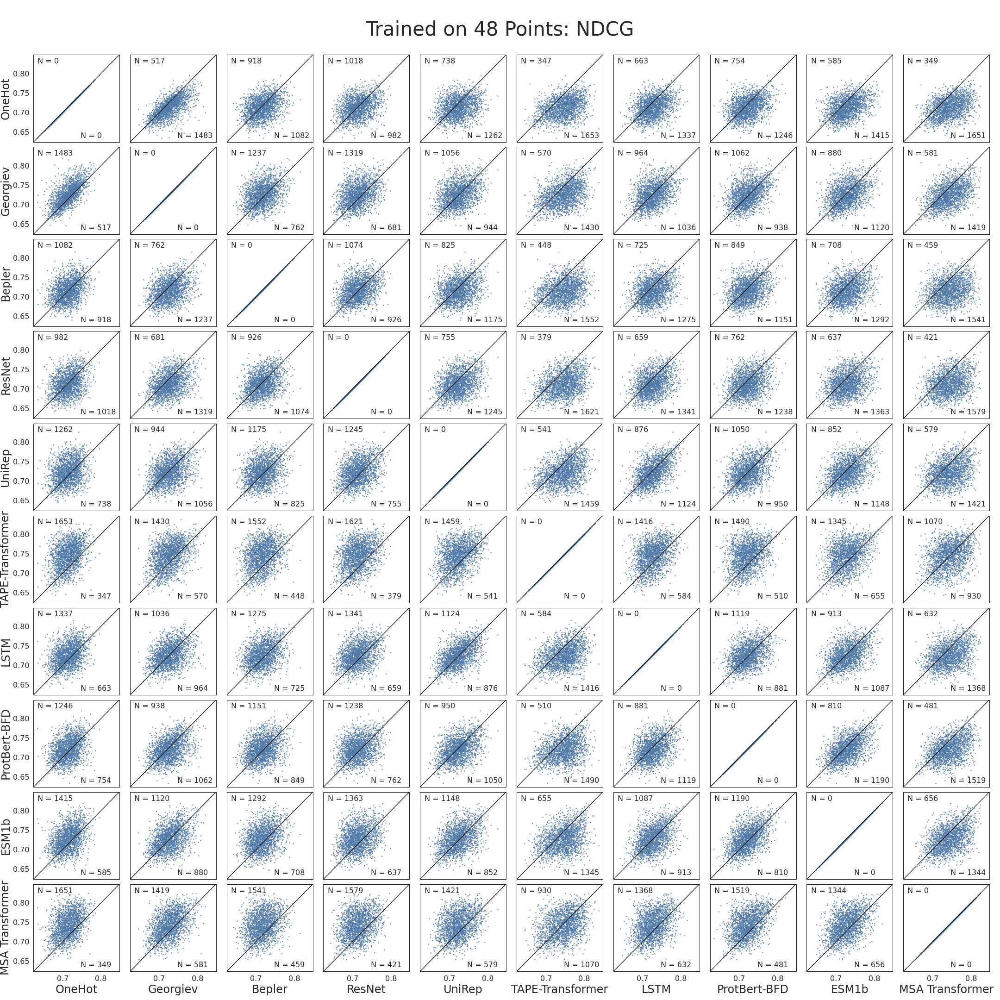

Pairwise Encoding Comparisons
=============================
This file displays additional data corresponding to the section "More Informative Encodings Can Improve MLDE Outcome" and Figure 2 of the manuscript associated with this  repository. When comparing the encodings, we used the same training variants, cross-validation indices, and random seeds for a given simulation. This allows us to make pairwise comparisons between the different summary metrics. Figures giving these pairwise comparisons are displayed in this file. Each figure is made up of a grid of 10x10 subplots. Each subplot plots the summary metrics resulting from 2000 simulated MLDE experiments for two different encoding strategies. The diagonal line gives x = y. The numbers on either side of the line give the respective number of points falling on that side; if the total of the two numbers doesn't equal "2000", that is because a certain number of simulations yielded equivalent results.

Table of Contents
-----------------
- [Pairwise Comparisons of Max Fitness Achieved for Different Screening Burdens](#pairwise-comparisons-of-max-fitness-achieved-for-different-screening-burdens)
- [Pairwise Comparisons of Mean Fitness Achieved for Different Screening Burdens](#pairwise-comparisons-of-mean-fitness-achieved-for-different-screening-burdens)
- [Pairwise Comparisons of NDCG for Different Screening Burdens](#pairwise-comparisons-of-ndcg-for-different-screening-burdens)

# Pairwise Comparisons of Max Fitness Achieved for Different Screening Burdens

# Pairwise Comparisons of Mean Fitness Achieved for Different Screening Burdens

# Pairwise Comparisons of NDCG for Different Screening Burdens

