Pairwise XGBoost Comparisons
=============================
This file displays additional data corresponding to the section "Models/Training Procedures More Tailored for Combinatorial Fitness Landscapes Improve MLDE Predictive Performance" of the manuscript associated with this  repository. When comparing the different learning objectives (Tweedie vs root mean squared) of XGBoost, we used the same training variants, cross-validation indices, and random seeds for a given simulation. This allows us to make pairwise comparisons between the different summary metrics. Figures giving these pairwise comparisons are displayed in this file. Results for all encodings tested in our work using either a Tree or Linear base XGBoost model are provided. Each figure gives the results of simulations at a given training size and using a given base model. Each figure contains a grid of 2x5 subplots. Each subplot gives the results of an encoding strategy using both the Tweedie learning objective (y-axis) and standard learning objective (x-axis). The diagonal line gives x = y. The numbers on either side of the line give the respective number of points falling on that side; if the total of the two numbers doesn't equal "2000", that is because a certain number of simulations yielded equivalent results.

Table of Contents
-----------------
- [Tree Base Model Results](#tree-base-model-results)
    - [Pairwise Comparisons of Max Fitness Achieved: Tree Base Model](#pairwise-comparisons-of-max-fitness-achieved-tree-base-model)
    - [Pairwise Comparisons of Mean Fitness Achieved: Tree Base Model](#pairwise-comparisons-of-mean-fitness-achieved-tree-base-model)
    - [Pairwise Comparisons of NDCG: Tree Base Model](#pairwise-comparisons-of-ndcg-tree-base-model)
- [Linear Base Model Results](#linear-base-model-results)
    - [Pairwise Comparisons of Max Fitness Achieved: Linear Base Model](#pairwise-comparisons-of-max-fitness-achieved-linear-base-model)
    - [Pairwise Comparisons of Mean Fitness Achieved: Linear Base Model](#pairwise-comparisons-of-mean-fitness-achieved-linear-base-model)
    - [Pairwise Comparisons of NDCG: Linear Base Model](#pairwise-comparisons-of-ndcg-linear-base-model)

# Tree Base Model Results
## Pairwise Comparisons of Max Fitness Achieved: Tree Base Model
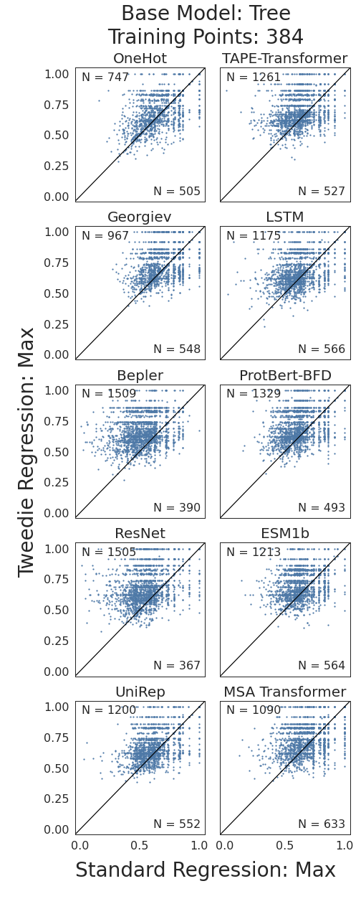
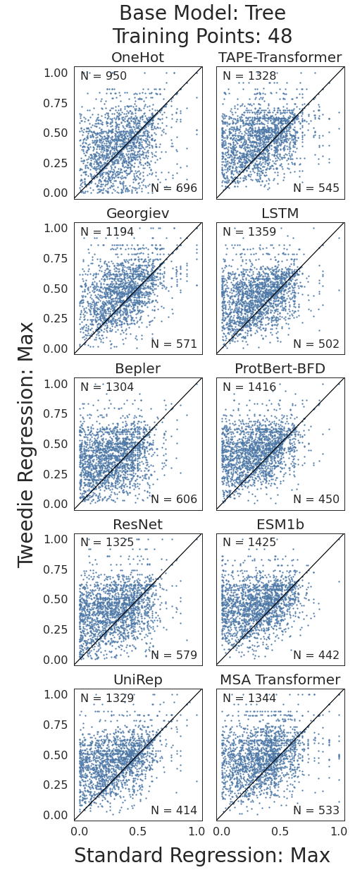
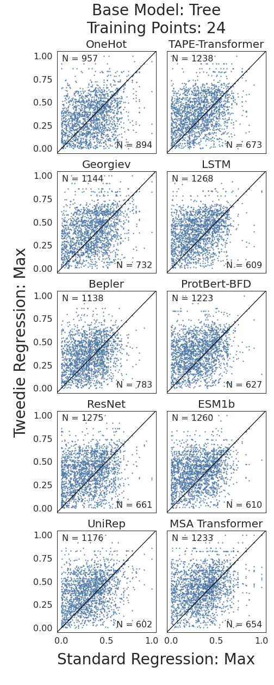

## Pairwise Comparisons of Mean Fitness Achieved: Tree Base Model
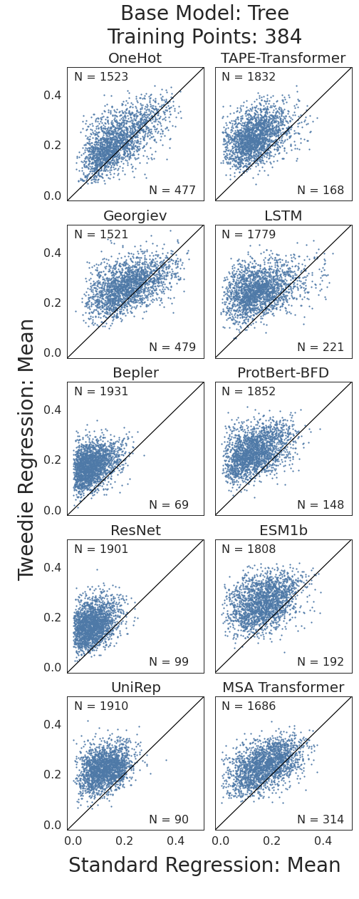
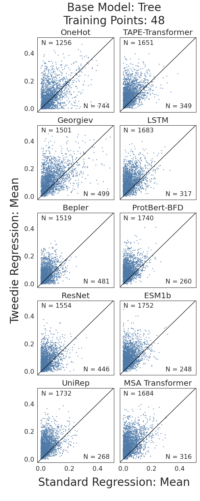
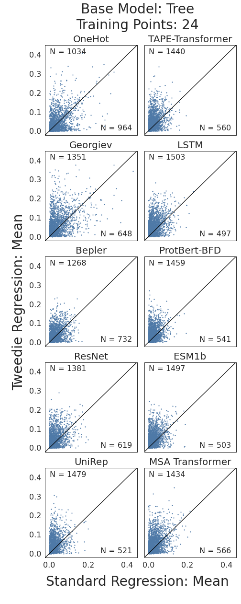

## Pairwise Comparisons of NDCG: Tree Base Model
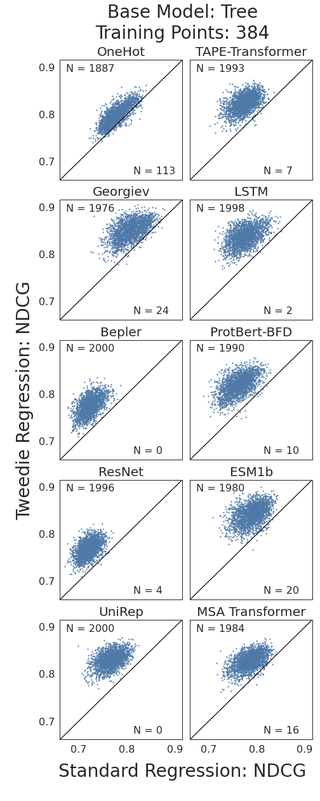
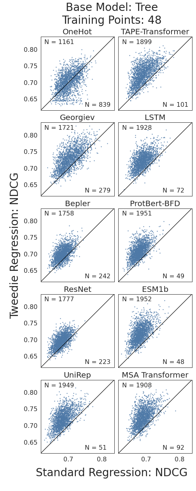

# Linear Base Model Results

## Pairwise Comparisons of Max Fitness Achieved: Linear Base Model
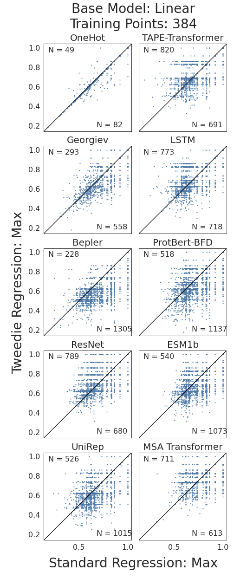
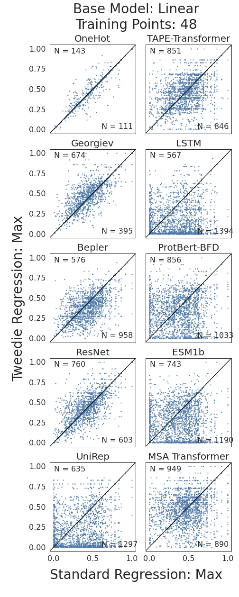
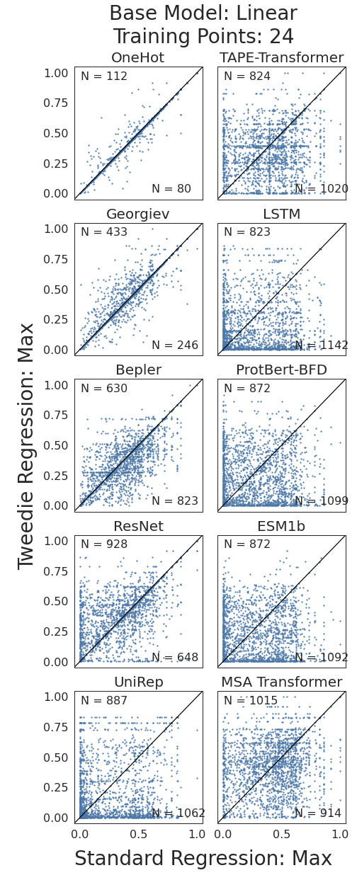

## Pairwise Comparisons of Mean Fitness Achieved: Linear Base Model
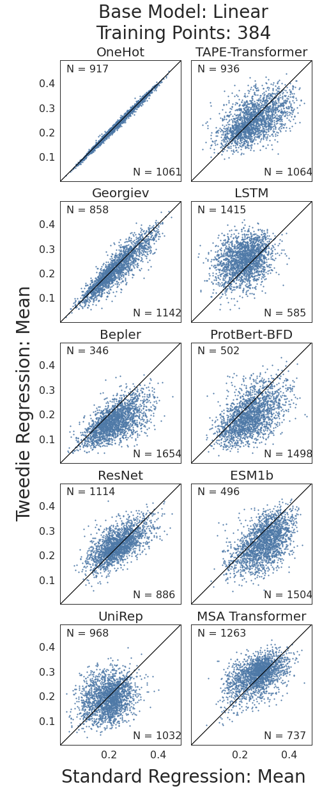
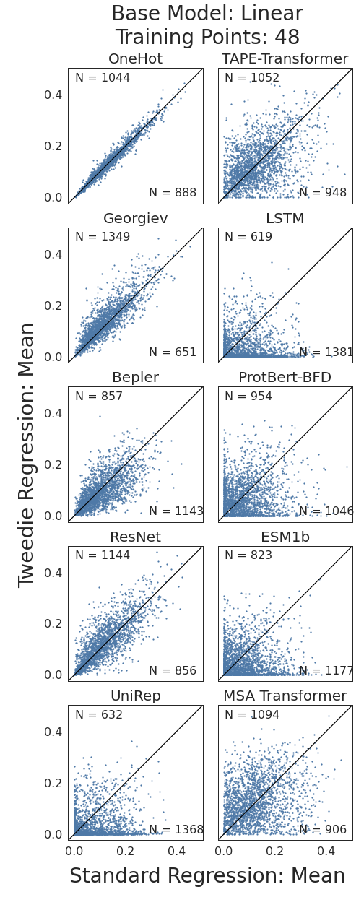
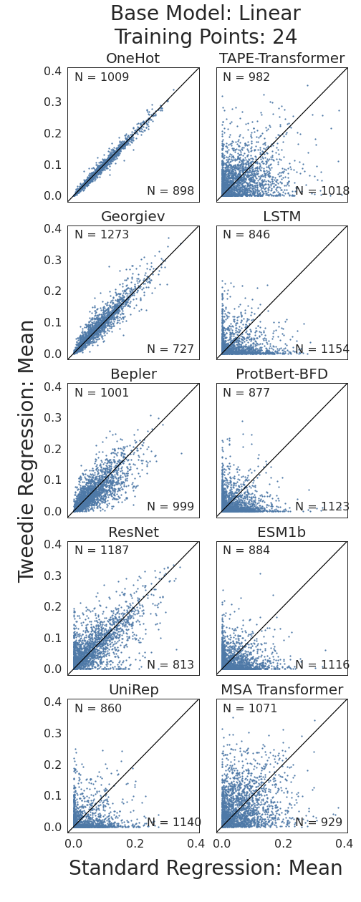

## Pairwise Comparisons of NDCG: Linear Base Model
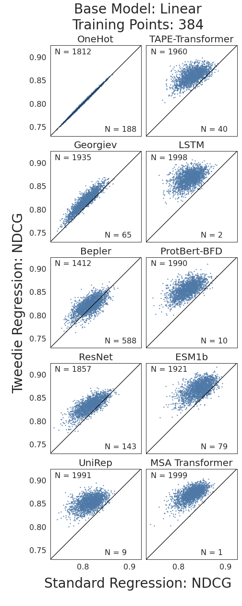
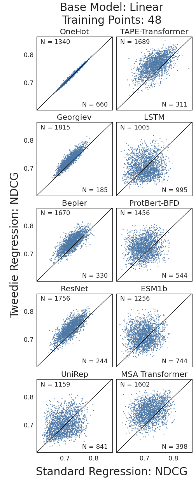
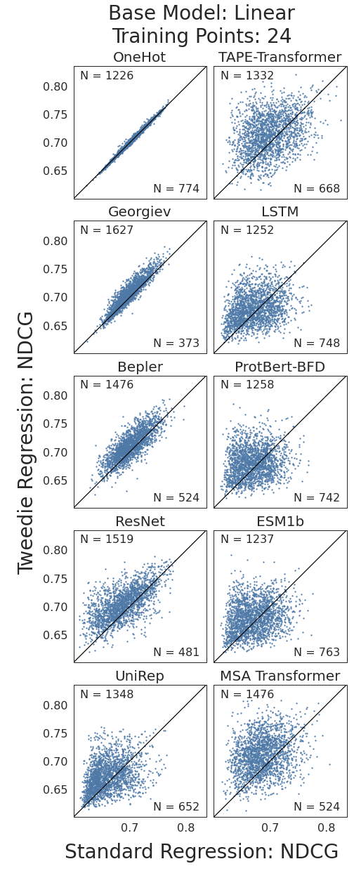